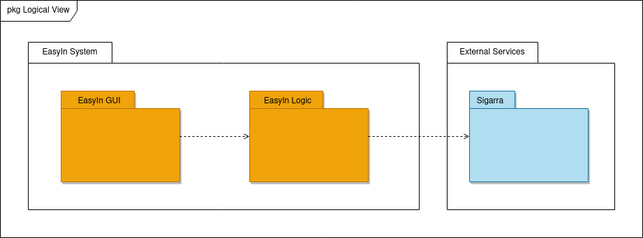

# Logical Architecture

## Description:

- ### EasyIn GUI
    This package contains all code related to the graphic user interface that will be presented to the Students.
    
- ### EasyIn Logic
    Contains the code to process the data of the features that we are going to implement, whether they are inputs from the Students or existing ones.
    
- ### Sigarra
    Contains Students data and API's needed to implement the features.

### Note:
Our application doesn't need a storage entity because all the data we handle depends directly on Sigarra.