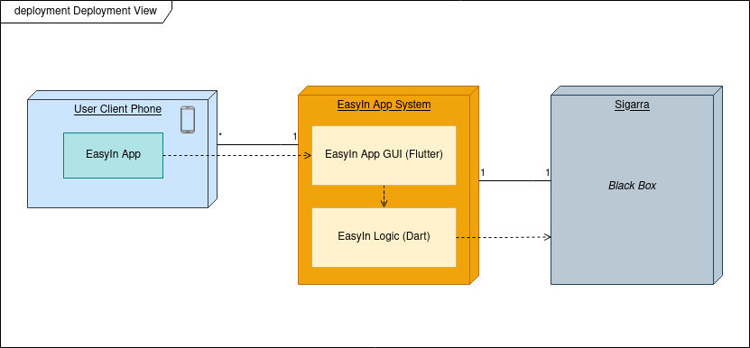

# Physical Architecture

## Description:

- ### User Client Phone
    Electronic device where the app will run.
    
- ### Easy App System
    Application developed by us that aims to satisfy the defined user stories.

  - **EasyIn App GUI:**
    Graphic User Interface that will be used by the Students to manipulate their data.
  
  - **EasyIn Logic:**
    It contains the real data that will support the features that we are going to implement, whether they are inputs from Students or others.

- ### Sigarra
    Where the Students data and API's necessary to implement the features are present.
