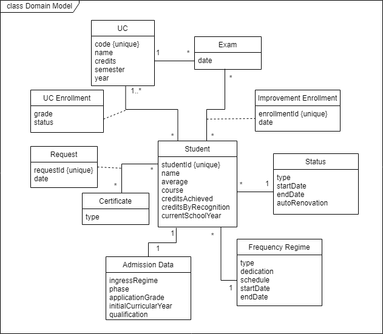

# Domain Model

## Classes:
- **Student**: Class representing a student with all the information related to the course he's in currently identified by an id.
- **Certificate**: Class representing a sigarra's certificate identified by type.
- **Request**: Associative class representing the certificate request of a student identified by an id.
- **Admission Data**: Class representing the student's admission data to a course.
- **Frequency Regime**: Class representing a student's frequency regime of his/her current course.
- **Status**: Class representing the student's status of his/her current course.
- **Exam**: Class representing a UC's Exam.
- **Improvement Enrollment**: Associative class representing an improvement exam enrollment of a student.
- **UC**: Class representing a certain UC identified by code.
- **UC Enrollment**: Associative class representing a student's enrollment in a UC.