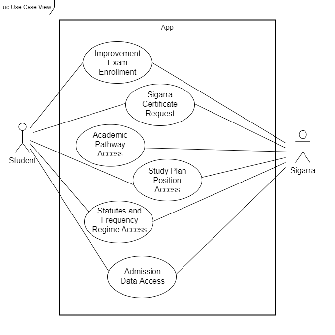

# Use case model

### Improvement Exam Enrollment

|||
| --- |-----|
| *Name* | Improvement Exam Enrollment |
| *Actor* | Student |
| *Description* | The Student enrolls in a maximum of three improvement exams in a certain course. |
| *Preconditions* | - The Student has passed a curricular unit of the Cycle of Studies in which they are enrolled, or were enrolled   - The Student has a valid email and mobile phone number   - The exam enrollment is done within the deadline **(1 week prior to the exam)**. |
| *Postconditions* | - The Student is enrolled in the improvement exam |
| *Normal flow* | 1. The Student opens the UNI app  2. The app shows the home screen  3. The Student opens the sidebar menu  4. The Student selects the "Avaliação" option  5. The Student selects the "Inscrição em Exame de Melhoria" option  6. The app shows important info on the exam enrollment and some available common forms  7. The Student selects a form  8. The app shows the exam enrollment form and asks the Student to confirm the enrollment terms and conditions  9. The Student fills in the form, scrolling the screen  10. The Student clicks in the Confirm button  11. The app shows the enrollment data that was just filled by the Student, asking for new confirmation  12. The app shows a success page in the process. |
| *Alternative flows and exceptions* | 1. [Required field failure] If, in step 9 of the normal flow the Student doesn't fill in a required field, the system gives the user the possibility to retry, showing a message in that field saying its mandatority  2. [Form confirmation failure] If, in step 11 of the normal flow the Student chooses to retrocede, it returns to the editable form of step 9. |
### Sigarra Certificate Request

|||
| --- | --- |
| *Name* | Sigarra Certificate Request |
| *Actor* | Student |
| *Description* | The Student requests the certificates he/she wants. |
| *Preconditions* | None |
| *Postconditions* | - Information about the request is added to the "Certificados" page. |
| *Normal flow* | 1. The Student opens the UNI app  2. The app shows the home screen  3. The Student opens the sidebar menu  4. The Student selects the "Avaliação" option  5. The Student selects the "Certificados" option and then clicks in the add button  6. The app shows the certificates that the Student can require  7. The Student selects the certificate he/she wants and proceeds  8. The app shows a form to be filled by the Student  9. The Student submits the forms. |
| *Alternative flows and exceptions* | 1. [Knowledge declaration acceptance failure] If, in step 8 of the normal flow the Student doesn't accept the declaration, the system doesn't give the user the possibility to proceed 2. [Required field selection failure] If, in step 8 of the normal flow the Student doesn't fill in a required field, the system gives the user the possibility to retry. |

### Academic Pathway Access

|||
| --- | --- |
| *Name* | Academic Pathway Access |
| *Actor* | Student |
| *Description* | The Student access his/her personal average, the amount of complete or obtained-by-recognition credits and can see the UC's in which is enrolled in that year. |
| *Preconditions* | - The Student needs to be enrolled in the UC's to gain access to them and to be able to see the list of these. |
| *Postconditions* | - The Student can consult his current average - The Student can consult the amount of complete or obtained-by-recognition credits - The Student is able to see a list of the UC's in which he is enrolled in the current year - The Student has access to a link to the Sigarra's page of each UC with the respective information. |
| *Normal flow* | 1. The Student opens the UNI app  2. The app shows the home screen  3. The Student opens the sidebar menu  4. The Student selects the "Avaliação" option  5. The Student selects the "Percurso Académico" option  6. The app shows the average and the credits at the top of the screen, followed by a list of the curricular units in which the Student is enrolled  7. The Student can see the personal average in each curricular unit and explore them. |
| *Alternative flows and exceptions* | 1. [Lack of enrollments in curricular units] If the Student isn't enrolled in any curricular unit, in step 6 of the normal flow, the system doesn't show the list of UC's. |

### Study Plan Position Access

|||
| --- | --- |
| *Name* | Study Plan Position Access |
| *Actor* | Student |
| *Description* | The Student can check all UC's in his Cycle of Studies, organized by year and semester, the status of each semester (complete or to be done), the status of each UC (registed, not registed, approved or approved by equivalence) and the grade obtained in each UC. Furthermore, if applicable, the Student can also check some specific enrollment instructions for one or more UC's. |
| *Preconditions* | None |
| *Postconditions* | - The Student is able to see all information related to his Cycle of Studies, specifically, each year, each semester and it's state, and each UC, it's result and state. |
| *Normal flow* | 1. The Student opens the UNI app  2. The app shows the home screen  3. The Student opens the side menu  4. The Student selects the "Avaliação" option  5. The Student selects the "Posição no Plano" option  6. The app shows the Student's academic pathway information as described in "Description"  7. The Student can explore the various semesters of the course's years, clicking on the arrows. |
| *Alternative flows and exceptions* | 1. [Information on the colors] Instead of clicking on the arrows in the step 7 of the normal flow, the Student can see the meaning of the colors clicking in the info button. |

### Statutes and Frequency Regime Access

|||
| --- | --- |
| *Name* | Statutes and Frequency Regime Access |
| *Actor* | Student |
| *Description* | The Student can view information on the statutes (for example, ordinary or worker Student) on the present school year, the beginning and ending dates of this statute, whether the renovation is automatic or not, and from which periods are the UCs to which the statutes applies to. It also shows, for the present academic year, the type of regime (online or face-to-face), dedication (partial or full-time), schedule (daytime or nighttime) and the beginning and ending dates. |
| *Preconditions* | - None |
| *Postconditions* | - The Student is able to see all information related to his statutes, over the academic years. |
| *Normal flow* | 1. The Student opens the UNI app  2. The app shows the home screen  3. The Student opens the side menu  4. The Student selects the "Avaliação" option  5. The Student selects the "Estatutos e Regimes de Frequência" option  6. The app shows the Student's statutes and frequency regime information as described in "Description". |
| *Alternative flows and exceptions* | None |

### Admission Data Access

|||
| --- | --- |
| *Name* | Admission Data Access |
| *Actor* | Student |
| *Description* | The Student accesses his/her course's entry, showing the respective lective year, the ingress regime, the phase the Student got admitted in, the application grade, the qualifications and initial curricular year. |
| *Preconditions* | None |
| *Postconditions* | - The Student is able to see the admission data about the current course. |
| *Normal flow* | 1. The Student opens the UNI app  2. The app shows the home screen  3. The Student opens the side menu  4. The Student selects the "Avaliação" option  5. The Student selects the "Dados de Ingresso" option  6. The app shows the Student's admission data as described in "Description". |
| *Alternative flows and exceptions* | None |
